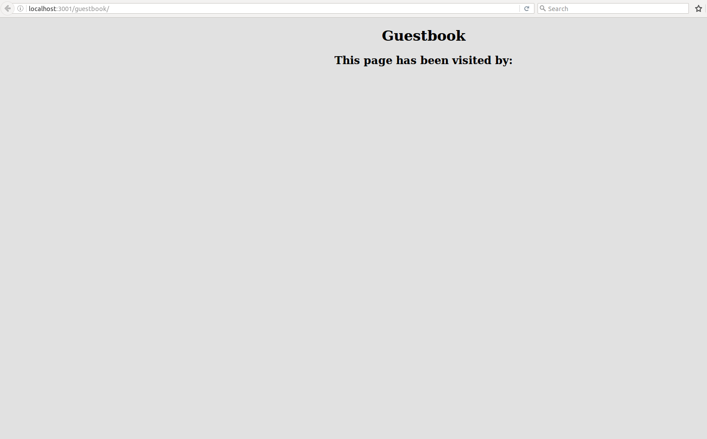

# Realtime Quick-Start

Developing a [Collaborative Real Time Editor](https://en.wikipedia.org/wiki/Collaborative_real-time_editor) is easier than ever!

You can find a list of useful repositories [here](./REPOSITORIES.md).

We're going to use some of them to produce a basic appliation that will familiarize you with the basics of writing software for real time collaboration.

This guide assumes you're using some kind of Unix-like operating system, Mac OSX or Linux-based distributions ought to work without problems.
Windows users may have to adapt instructions.

Let's get started!

### Setting up your Server

We'll be using **Chainpad-Server** as a back end for our app.

To get your server running, follow the [installation guide](https://github.com/xwiki-labs/chainpad-server#installation), and then launch your server using `node server.js`.

### Writing your App

We're going to build a **Realtime Guestbook**.
When somebody visits the page, they'll be prompted to input their name.
Once they've entered their name, it will be added to a list a of visitors.

The twist for this simple app is that the list of visitors is actually a realtime datastructure.
When a new visitor modifies the datastructure, other users' pages will update to reflect their changes.

If you look inside your server's `www/` directory, you'll find a `template/` directory, which contains two files:

* `index.html`
* `main.js`

Our application will use this same structure.


```BASH
# Navigate into the www/ directory, if you aren't already there
cd ./www/;

# Create a folder for your app
mkdir guestbook;

# Navigate into your new folder
cd guestbook;
```

Your next step is to create some basic HTML that you can view in your browser.

Using your favourite text editor, Open `index.html`, paste the following code into it, and save.

```
<!DOCTYPE html>
<html>
<head>
    <meta content="text/html; charset=utf-8" http-equiv="content-type"/>
    <meta name="viewport" content="width=device-width, initial-scale=1.0"/>
    <script data-main="main" src="/bower_components/requirejs/require.js"></script>
    <style>
        html, body{
            padding: 0px;
            margin: 0px;
            overflow: hidden;
            box-sizing: border-box;
            background-color: #e1e1e1;
        }
        body {
            width: 50vw;
            margin: auto;
        }
        h1, h2 { text-align: center; }
        pre { font-size:30px; }
    </style>
</head>
<body>
    <h1>Guestbook</h1>
    <h2>This page has been visited by:</h2>
    <pre id="visitors"></pre>

</body>
</html>
```

Assuming you're using the default configuration for your server, you should now be able to visit http://localhost:3001/guestbook/.

It should look something like this:




